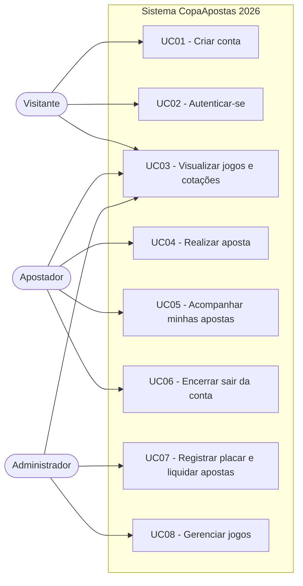

# 1. Casos de Uso — CopaApostas 2026

Este documento descreve os **casos de uso principais** do sistema de
gerenciamento de apostas dos jogos da Copa do Mundo 2026.

## Atores

| Ator              | Descrição                                                                 |
| ----------------- | ------------------------------------------------------------------------- |
| **Visitante**     | Usuário não autenticado. Pode ver os jogos e as cotações, e criar conta.  |
| **Apostador**     | Usuário autenticado (papel `user`). Aposta e acompanha suas apostas.      |
| **Administrador** | Usuário autenticado (papel `admin`). Gerencia jogos e registra placares.  |

> O **Apostador** e o **Administrador** são especializações de um Usuário
> autenticado; o Administrador herda tudo que o Apostador faz e ainda gerencia
> os jogos.

## Diagrama de Casos de Uso

> O diagrama acima usa a sintaxe **Mermaid** (renderiza automaticamente no
> GitHub). Uma versão em imagem está em
> [`wireframes/diagrama-casos-de-uso.svg`](wireframes/diagrama-casos-de-uso.svg).

---

## Descrição dos Casos de Uso

### UC01 — Criar conta

- **Ator:** Visitante
- **Objetivo:** Registrar-se no sistema para poder apostar.
- **Pré-condições:** Não estar autenticado.
- **Fluxo principal:**
  1. O visitante acessa a tela de **Cadastro**.
  2. Informa nome, e-mail e senha.
  3. O sistema valida os dados e verifica se o e-mail já existe.
  4. O sistema cria o usuário com **saldo inicial de R$ 1.000** (moedas virtuais)
     e retorna um token JWT, autenticando-o automaticamente.
- **Fluxos alternativos:**
  - **3a.** E-mail já cadastrado → o sistema exibe mensagem de erro.
  - **3b.** Campos vazios/ inválidos → o sistema impede o cadastro.
- **Pós-condições:** Usuário autenticado e redirecionado para a lista de jogos.

### UC02 — Autenticar-se (Login)

- **Ator:** Visitante
- **Objetivo:** Entrar no sistema com uma conta existente.
- **Pré-condições:** Possuir conta cadastrada.
- **Fluxo principal:**
  1. O visitante acessa a tela de **Login**.
  2. Informa e-mail e senha.
  3. O sistema valida as credenciais (compara o hash bcrypt da senha).
  4. O sistema gera um token JWT e direciona o usuário à lista de jogos.
- **Fluxos alternativos:**
  - **3a.** Credenciais inválidas → mensagem "E-mail ou senha inválidos".
- **Pós-condições:** Usuário autenticado.

### UC03 — Visualizar jogos e cotações

- **Atores:** Visitante, Apostador, Administrador
- **Objetivo:** Consultar os jogos da Copa 2026 e suas cotações.
- **Pré-condições:** Nenhuma (rota pública).
- **Fluxo principal:**
  1. O ator acessa a tela de **Jogos**.
  2. O sistema lista os jogos ordenados por data (a partir de 25/06/2026),
     exibindo times, fase, estádio, data/hora e as odds (Casa/Empate/Fora).
  3. Jogos abertos exibem botões de aposta; jogos encerrados exibem o placar
     final.
- **Pós-condições:** Nenhuma.

### UC04 — Realizar aposta

- **Ator:** Apostador
- **Objetivo:** Apostar moedas virtuais em um resultado de jogo.
- **Pré-condições:** Estar autenticado; o jogo estar **agendado** e ainda não ter
  começado; ter saldo suficiente.
- **Fluxo principal:**
  1. Na lista de jogos, o apostador escolhe um palpite (Casa, Empate ou Fora).
  2. O sistema abre o "ticket" de aposta com a odd selecionada.
  3. O apostador informa o valor e vê o **retorno potencial** (valor × odd).
  4. Ao confirmar, o sistema valida o saldo, **debita o valor**, **congela a odd**
     e registra a aposta como `pendente`.
- **Fluxos alternativos:**
  - **1a.** Usuário não autenticado → redirecionado para o Login.
  - **4a.** Saldo insuficiente → mensagem de erro.
  - **4b.** Jogo já iniciado/encerrado → aposta recusada.
- **Pós-condições:** Aposta registrada; saldo do apostador atualizado.

### UC05 — Acompanhar minhas apostas

- **Ator:** Apostador
- **Objetivo:** Consultar o histórico e os resultados das próprias apostas.
- **Pré-condições:** Estar autenticado.
- **Fluxo principal:**
  1. O apostador acessa **Minhas Apostas**.
  2. O sistema lista as apostas com jogo, palpite, valor, odd, situação
     (pendente/ganha/perdida) e retorno, além de um resumo (total apostado,
     total ganho).
- **Pós-condições:** Nenhuma.

### UC06 — Sair da conta (Logout)

- **Ator:** Apostador / Administrador
- **Fluxo principal:** O usuário clica em "Sair"; o sistema descarta o token e
  volta ao estado de visitante.

### UC07 — Registrar placar e liquidar apostas

- **Ator:** Administrador
- **Objetivo:** Encerrar um jogo informando o placar e pagar os vencedores.
- **Pré-condições:** Estar autenticado como **admin**; o jogo estar agendado.
- **Fluxo principal:**
  1. No **Painel do Administrador**, o admin informa o placar (gols casa × fora).
  2. Ao encerrar, o sistema determina o resultado (home/draw/away), marca o jogo
     como `encerrado` e guarda o placar.
  3. O sistema percorre todas as apostas `pendentes` do jogo:
     - acertos → status `ganha` e **crédito de `valor × odd`** no saldo do
       apostador;
     - erros → status `perdida`.
- **Fluxos alternativos:**
  - **1a.** Placar incompleto → mensagem de erro.
  - **2a.** Jogo já encerrado → operação recusada.
- **Pós-condições:** Jogo encerrado; apostas liquidadas; saldos atualizados.

### UC08 — Gerenciar jogos

- **Ator:** Administrador
- **Objetivo:** Criar e atualizar jogos (times, fase, data, estádio, odds).
- **Pré-condições:** Estar autenticado como **admin**.
- **Fluxo principal:** O admin envia os dados do jogo; o sistema valida e
  persiste. *(Os jogos iniciais são criados pelo script de seed.)*
- **Pós-condições:** Catálogo de jogos atualizado.

---

## Matriz de Permissões (resumo)

| Caso de uso                         | Visitante | Apostador | Admin |
| ----------------------------------- | :-------: | :-------: | :---: |
| UC01 Criar conta                    |     ✅     |     —     |   —   |
| UC02 Login                          |     ✅     |     —     |   —   |
| UC03 Visualizar jogos               |     ✅     |     ✅     |   ✅   |
| UC04 Realizar aposta                |     ❌     |     ✅     |   ✅   |
| UC05 Minhas apostas                 |     ❌     |     ✅     |   ✅   |
| UC06 Logout                         |     —     |     ✅     |   ✅   |
| UC07 Registrar placar / liquidar    |     ❌     |     ❌     |   ✅   |
| UC08 Gerenciar jogos                |     ❌     |     ❌     |   ✅   |
