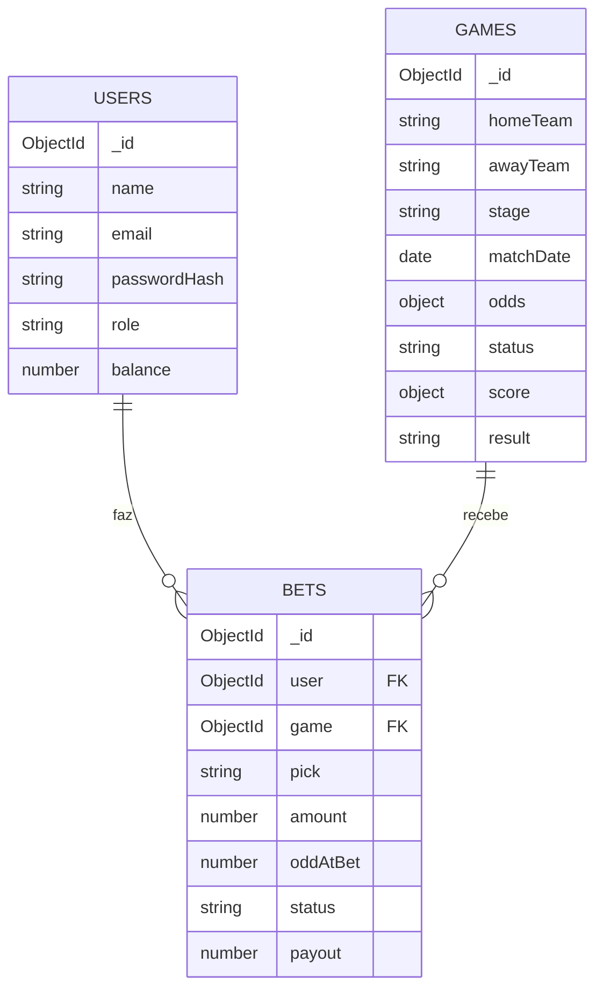

# 6. Estrutura de Armazenamento de Dados no MongoDB

O banco **`copaApostas`** é composto por **três coleções**: `users`, `games` e
`bets`. O modelo segue o estilo de documentos do MongoDB, usando **referências**
(`ObjectId`) entre apostas, usuários e jogos — análogo a chaves estrangeiras no
modelo relacional.

## Visão geral das coleções

| Coleção  | Descrição                                   | Relacionamentos                         |
| -------- | ------------------------------------------- | --------------------------------------- |
| `users`  | Apostadores e administradores               | —                                       |
| `games`  | Jogos da Copa 2026 e suas cotações (odds)   | —                                       |
| `bets`   | Apostas feitas pelos usuários               | referencia `users` e `games`            |



---

## Coleção `users`

Armazena os usuários. A senha **nunca** é guardada em texto puro — apenas o hash
gerado com **bcrypt**. O campo `role` controla o acesso (`user` ou `admin`).

| Campo          | Tipo     | Descrição                                          |
| -------------- | -------- | -------------------------------------------------- |
| `_id`          | ObjectId | Identificador único (gerado pelo MongoDB)          |
| `name`         | String   | Nome do usuário                                    |
| `email`        | String   | E-mail (único, em minúsculas)                      |
| `passwordHash` | String   | Hash bcrypt da senha                               |
| `role`         | String   | `"user"` ou `"admin"`                              |
| `balance`      | Number   | Saldo de moedas virtuais (padrão 1000)             |
| `createdAt`    | Date     | Data de criação (automático)                       |
| `updatedAt`    | Date     | Data de atualização (automático)                   |

**Exemplo de registro:**

```json
{
  "_id": { "$oid": "6a3c4bcb23b15d630e257c70" },
  "name": "João Apostador",
  "email": "joao@email.com",
  "passwordHash": "$2a$10$N9qo8uLOickgx2ZMRZoMy.MH/rTe5e5K...",
  "role": "user",
  "balance": 900,
  "createdAt": { "$date": "2026-06-24T21:27:39.900Z" },
  "updatedAt": { "$date": "2026-06-24T21:27:40.110Z" }
}
```

---

## Coleção `games`

Cada documento é um jogo da Copa 2026, com as cotações (`odds`) embutidas como
**subdocumento** (dado que sempre é lido junto com o jogo). Quando o jogo é
encerrado, `score`, `result` e `status` são preenchidos.

| Campo        | Tipo        | Descrição                                                       |
| ------------ | ----------- | --------------------------------------------------------------- |
| `_id`        | ObjectId    | Identificador único                                             |
| `homeTeam`   | String      | Time mandante                                                   |
| `awayTeam`   | String      | Time visitante                                                  |
| `stage`      | String      | Fase (`Fase de Grupos`, `Rodada de 32`, ... `Final`)           |
| `group`      | String      | Grupo (ex.: "Grupo F"); ausente no mata-mata                    |
| `stadium`    | String      | Estádio                                                         |
| `city`       | String      | Cidade/sede                                                     |
| `matchDate`  | Date        | Data e hora do jogo (sempre ≥ 25/06/2026)                       |
| `odds`       | Subdocumento| `{ home, draw, away }` — multiplicadores de pagamento           |
| `status`     | String      | `"agendado"` ou `"encerrado"`                                   |
| `score`      | Subdocumento| `{ home, away }` — placar (null enquanto não encerra)           |
| `result`     | String      | `"home"`, `"draw"`, `"away"` ou null                            |

**Exemplo — jogo agendado:**

```json
{
  "_id": { "$oid": "6a3c4bcb23b15d630e257c78" },
  "homeTeam": "Brasil",
  "awayTeam": "Croácia",
  "stage": "Fase de Grupos",
  "group": "Grupo F",
  "stadium": "SoFi Stadium",
  "city": "Los Angeles, EUA",
  "matchDate": { "$date": "2026-06-25T22:00:00.000Z" },
  "odds": { "home": 1.65, "draw": 3.7, "away": 5.2 },
  "status": "agendado",
  "score": { "home": null, "away": null },
  "result": null
}
```

**Exemplo — jogo encerrado:**

```json
{
  "_id": { "$oid": "6a3c4bcb23b15d630e257c88" },
  "homeTeam": "Brasil",
  "awayTeam": "França",
  "stage": "Final",
  "stadium": "MetLife Stadium",
  "city": "Nova York/Nova Jersey, EUA",
  "matchDate": { "$date": "2026-07-19T16:00:00.000Z" },
  "odds": { "home": 2.45, "draw": 3.2, "away": 2.85 },
  "status": "encerrado",
  "score": { "home": 2, "away": 1 },
  "result": "home"
}
```

---

## Coleção `bets`

Cada documento é uma aposta. Referencia o usuário (`user`) e o jogo (`game`) por
`ObjectId`. A cotação é **congelada** em `oddAtBet` no momento da aposta, para
que mudanças posteriores nas odds do jogo não afetem apostas já feitas.

| Campo       | Tipo     | Descrição                                                  |
| ----------- | -------- | ---------------------------------------------------------- |
| `_id`       | ObjectId | Identificador único                                        |
| `user`      | ObjectId | Referência ao documento em `users`                         |
| `game`      | ObjectId | Referência ao documento em `games`                         |
| `pick`      | String   | Palpite: `"home"`, `"draw"` ou `"away"`                    |
| `amount`    | Number   | Valor apostado (moedas virtuais)                           |
| `oddAtBet`  | Number   | Cotação congelada no momento da aposta                     |
| `status`    | String   | `"pendente"`, `"ganha"` ou `"perdida"`                    |
| `payout`    | Number   | Valor recebido se ganhou (`amount × oddAtBet`), senão 0    |
| `createdAt` | Date     | Data da aposta                                             |

**Exemplo de registro (aposta ganha):**

```json
{
  "_id": { "$oid": "6a3c4bcb23b15d630e257c90" },
  "user": { "$oid": "6a3c4bcb23b15d630e257c70" },
  "game": { "$oid": "6a3c4bcb23b15d630e257c78" },
  "pick": "home",
  "amount": 200,
  "oddAtBet": 1.65,
  "status": "ganha",
  "payout": 330,
  "createdAt": { "$date": "2026-06-24T21:30:00.000Z" }
}
```

---

## Decisões de modelagem

- **Embutir vs. referenciar:** `odds` e `score` são **embutidos** no jogo porque
  só fazem sentido junto dele e são sempre lidos juntos. Já `user` e `game` nas
  apostas são **referências**, pois são entidades independentes e reaproveitadas
  por muitas apostas (evita duplicação).
- **`oddAtBet` (congelamento da cotação):** garante a "cota fixa" — a aposta paga
  pela odd vigente quando foi feita, mesmo que a odd do jogo mude depois.
- **Saldo no usuário:** o `balance` é debitado ao apostar e creditado na
  liquidação, mantendo o estado financeiro do apostador sempre consistente.
- **Índice único em `email`:** o Mongoose cria um índice `unique` no campo
  `email` da coleção `users`, impedindo cadastros duplicados.

## Como inspecionar os dados

Com o **mongosh** (cliente do MongoDB) é possível consultar as coleções:

```javascript
use copaApostas
db.users.find().pretty()
db.games.find({ stage: "Final" }).pretty()
db.bets.find({ status: "ganha" }).pretty()
```
